# About this Repository
AtScale's semantic layer platform simplifies the access to data through a unified, business-friendly interface, allowing users with varying levels of technical expertise to understand and analyze data without needing to know complex query languages or database structures. This accessibility leads to better, faster decision-making across all levels of an organization. Moreover, by standardizing definitions and metrics, a semantic layer ensures consistency and accuracy in reporting and analytics, reducing errors and misinterpretations.

This repository contains a variety of semantic models encoded in the **S**emantic **M**odeling **L**anguage (SML).

# Model Library

## Tutorial Models
1. [Internet Sales](models/tutorials/internet-sales) - a simple, single fact model derived from the ficticious AdventureWorks retail dataset
2. [World Wide Importers](models/tutorials/world-wide-importers) - a more complex, multi-fact model that represents a fictional wholesale and distribution company
3. [TPC-DS](models/tutorials/tpc-ds) - a complex, multi-fact model that encodes the [TPC-DS](https://www.tpc.org/tpcds/) benchmark model in SML

# Getting Started

## How to the Install AtScale Semantic Layer Platform
Download the [AtScale Developer Community Edition](http://www.atscale.com/community) and follow the installation instructions

## How to Connect to Tutorial Data in AtScale
### How to Use the Pre-configured PostgresSQL Tutorial Data
When you download and install the AtScale Developer Community edition, a PostgresSQL database container with the data for all three models will be installed and configured automatically in AtScale Design Center. 

To explore and query the tutorial models, in AtScale Design Center:

1. **Deploy your Catalog:** Click on the "Repo Browser" icon in the Activity bar (left side) and Press the "Deploy" button.

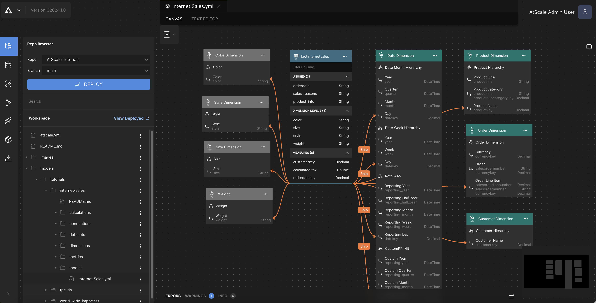

2. **(Optional) Enable Token-based Access for Excel & Power BI:** In order to connect Excel and Power BI without AtScale's imbedded directory service, generate an XMLA token by clicking on the user profile icon (upper right) and clicking on the "Generate Token" button.

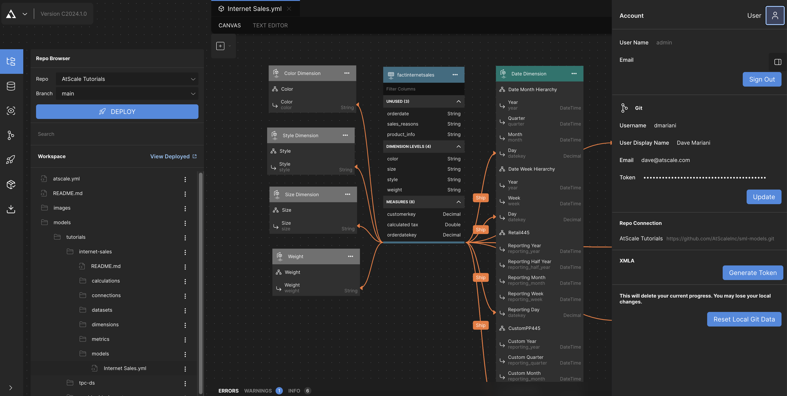

3. **Connect your BI Tool:** Click on the "Deployed Catalogs: icon in the Activity bar (left side) and click on your deployed catalog. Instructions for connecting your BI tools will appear on the right side.

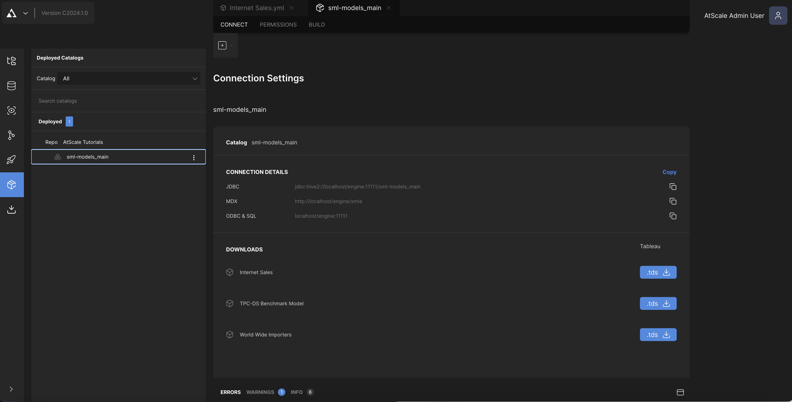

### How to Connect to Snowflake Tutorial Data
The tutorial data for the sample models is available for free in the Snowflake Marketplace. To get access to the tutorial data in the Snowflake Marketplace:

1. **Go to the Snowflake Marketplace:** In the Snowflake console, Click on "Data Products" and then click on the "Marketplace" link.

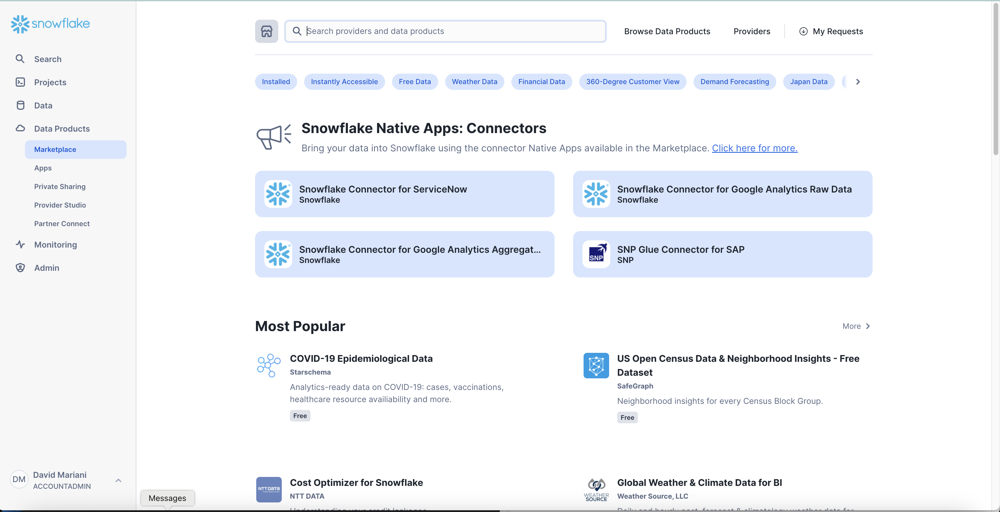

2. **Find the "AtScale Tutorials" data product:** In the search bar, type in "AtScale" and select the "AtScale Tutorials" data product.

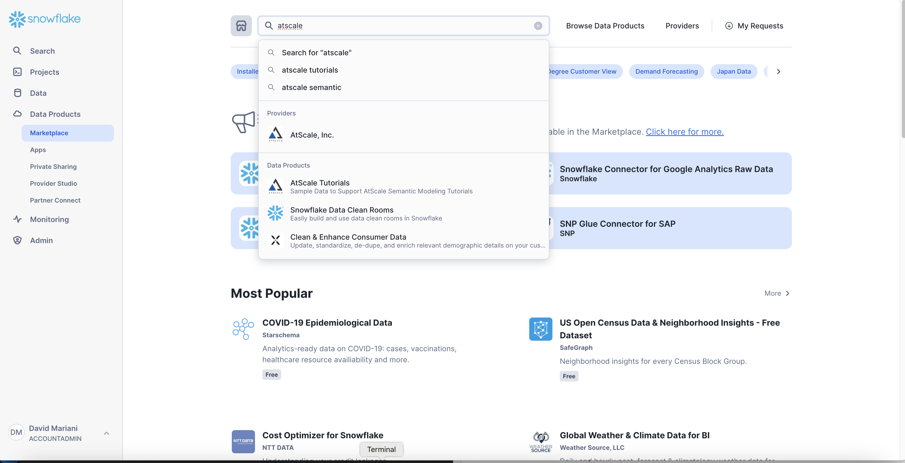

3. **Connect to the AtScale Tutorials Data Product:** On the right side of the screen, click on the "Get" button.

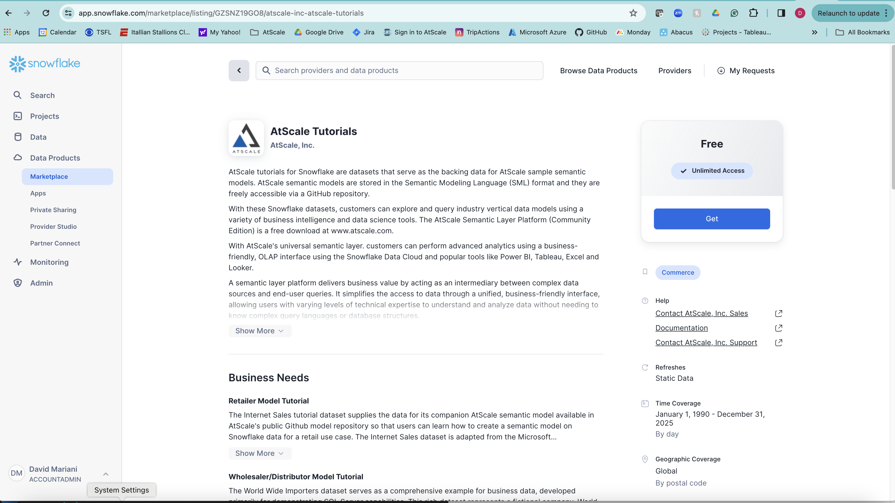

4. **Name Your Database:** Click on the down arrow on the "Options" accordian control and enter `atscale_tutorial_data` in the "Database" field and assign the proper access role. Click the "Get" button.

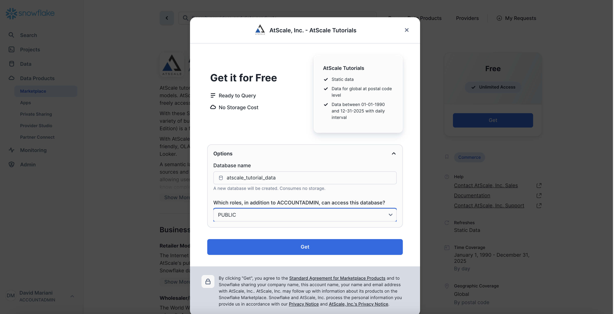

### How to Connect to Databricks Tutorial Data

*Coming soon to the Databricks Marketplace*

### How to Load to Tutorial Data into BigQuery

1. Create a project named `atscale-tutorial-data` in BigQuery
2. In the BigQuery console for the `atscale-tutorial-data` project, run the following DDL scripts in this [directory](data/loaders/bigquery):
	1. [`load-as-adventure.sql`](data/loaders/bigquery/load-as_adventure.sql)
	2. [`load-ww-importers.sql`](data/loaders/bigquery/load-ww-importers.sql)
	3. [`load-tpcds.sql`](data/loaders/bigquery/load-tpcds.sql)

## Creating an AtScale Connection to your Own Data

1. **Go to AtScale Settings:** In AtScale Design Center, click on the "Settings" dropdown by clicking on the AtScale logo icon (upper left).

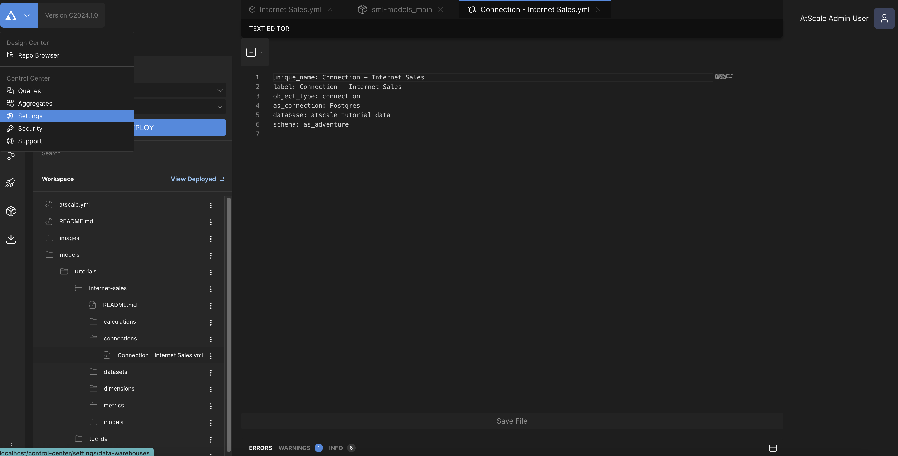

2. **Create a Data Warehouse:** In Settings, click on the "Data Warehouse" option (top left) and click on the icon (right) for the data platform you wish to connect (i.e. BigQuery, Snowflake, Databricks, etc.).

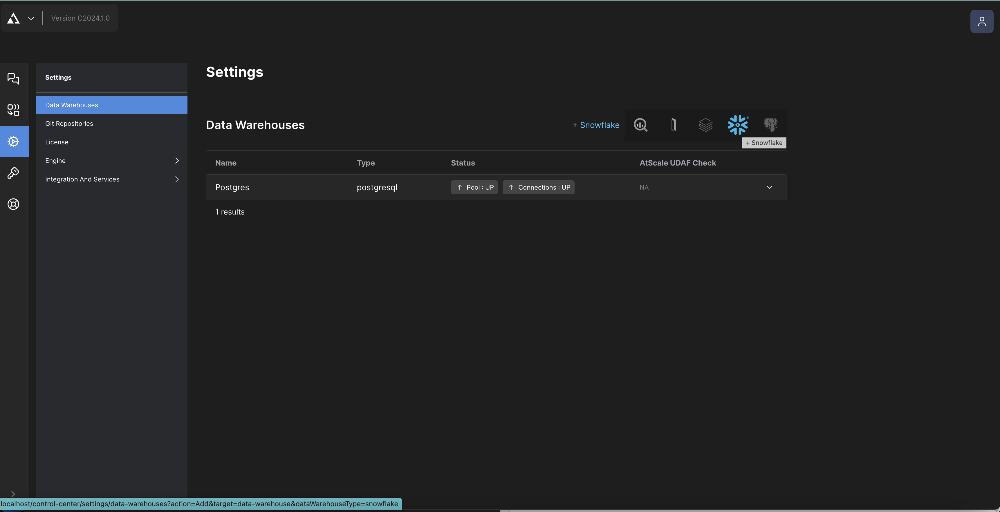

2. **Enter Data Warehouse Information:** In the Data Warehouse property panel, enter your information and click on the "Apply" button. **Note that you may need to create a new database and schema to hold AtScale's aggregate tables.**

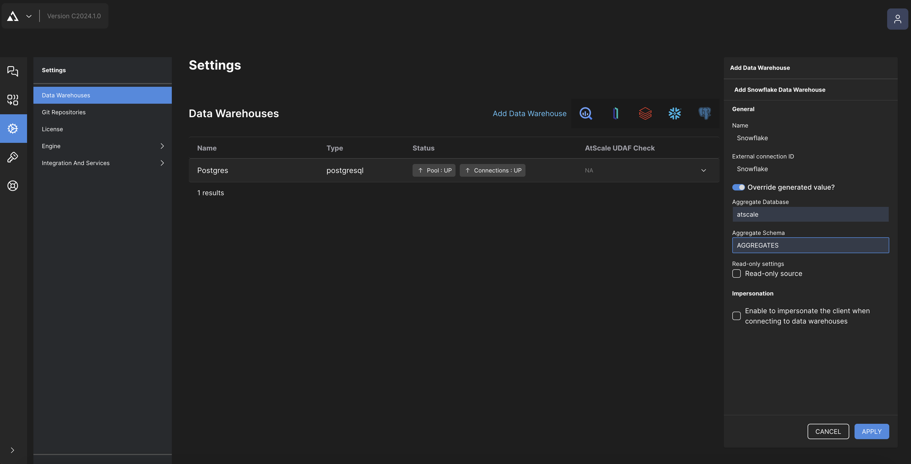

3. **Create a Data Warehouse Connection:** After creating the data warehouse, create a connection by clicking on the down arrow on the data warehouse your just created and click on the "Add Connection +" button.

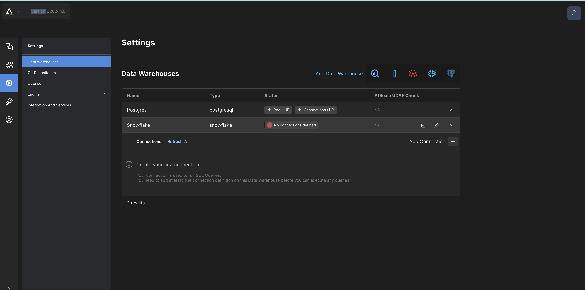

4. **Enter Data Warehouse Connection Information:** In the Data Warehouse Connection property panel, enter your information and click on the "Apply" button.

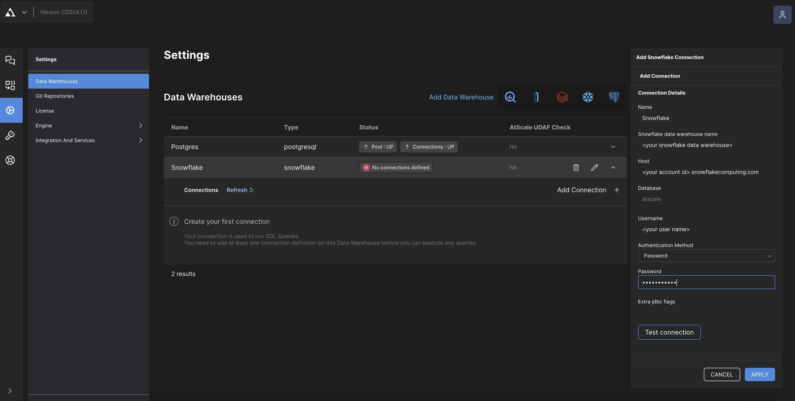

5. **Change your SML Connection:** Go back to the Repo Browser by clicking on the AtScale icon (upper left corner) and update each model's connection YML file's `as_connection` property to to same string (i.e. "Snowflake") you entered into "External connection ID" field in the Data Warehouse Connection property panel in step 3. Make sure to click on the "Save File" button at the bottom of the text editor.

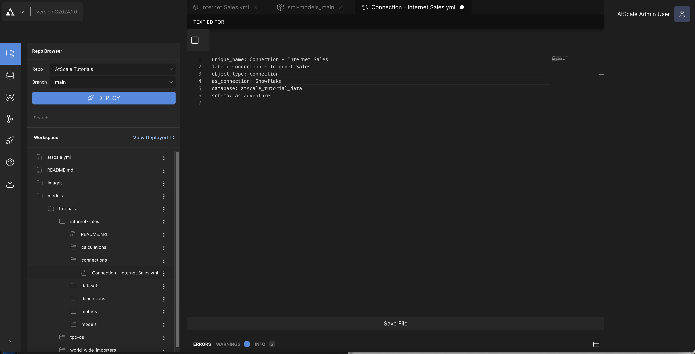

6. Deploy your catalog (see above).

## Aditional Resources
