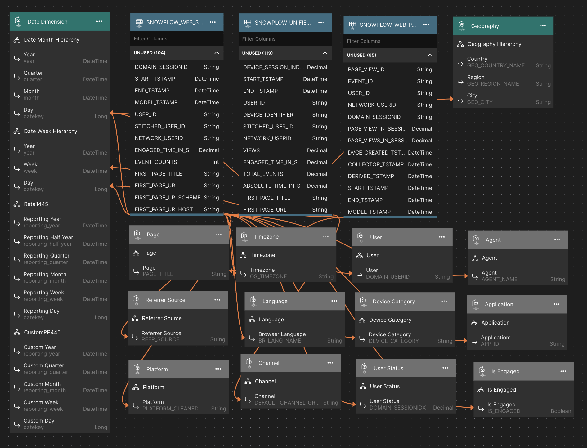

# Snowplow Digital Analytics Model

Over two million sites and applications use Snowplow to generate and model first-party customer data from across their digital interfaces to capture descriptive customer journeys and build actionable first-party behavioral profiles. Snowplow empowers organizations to create a scalable, first-party data foundation so marketing and data teams can effectively analyze and tackle Customer 360 use cases, such as customer acquisition, engagement, segmentation and retention.

In leveraging out-of-the-box data models to aggregate journeys across web and mobile, Snowplow deterministically identifies a single view of the customer in Snowflake for analytics purposes. In comparison to more traditional tools like Google Analytics, Snowplow Digital Analytics offers a scalable solution to collect deeper behavioral insights into customer journeys within the Data Cloud. Toggle through turnkey visualizations powered by first-party data to better understand behavioral trends with website/app engagement, customer retention, campaign performance, demographics, and other insightful user metrics. With new and improved insights into your customer base, companies can take necessary action in their marketing, product, and business strategy to drive innovation and maintain competitive advantages.

With Snowplow, organizations like Strava, Burberry, and Autotrader acquire, engage and retain customers in a scalable manner, while retaining an industry-leading data governance posture with full GDPR and CCPA compliance.

## Demonstrated Model Features
1. Multi-fact model
2. Calculated Columns
3. Time-relative calculations

## Supported Data Platforms
1. Snowflake

## Data Model Overview

## Data Loading Instructions

### Snowflake
