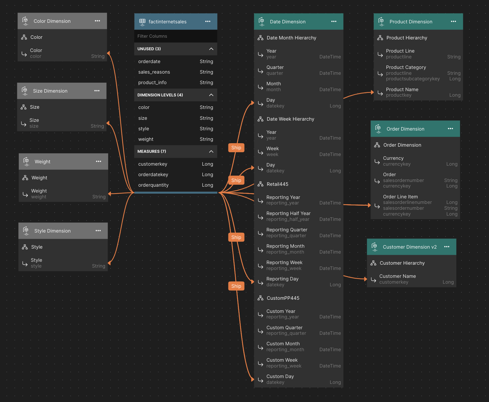

# Internet Sales Model

The Internet Sales dataset is adapted from the Microsoft AdventureWorks tutorial database which simulates a manufacturing company that sells bicycles and bicycle accessories, including product inventory, sales orders, employee information, and customer data. It serves as a comprehensive example for demonstrating data warehousing, star schemas, reporting, data integration, and analytics practices.

## Demonstrated Model Features
1. Single fact model
2. Calculated Columns
3. Time-relative calculations
4. Query Dataset
2. Row-level security

## Supported Data Platforms
1. Snowflake
2. Databricks

## Data Model Overview

## Data Loading Instructions

### Snowflake
### Databricks
